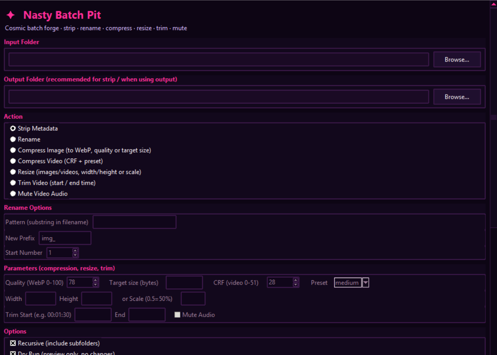
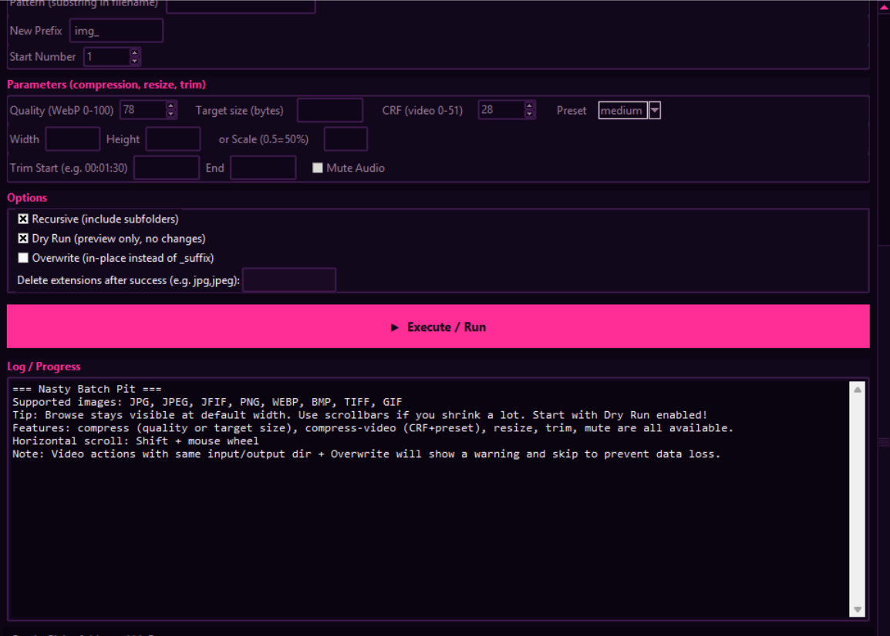

# Nasty Batch Pit

Formerly **Image-Batch-Processor**. Same production batch tools — **cosmic purple / hot magenta** night-ops skin (GUI).

Complete, production-grade **CLI + GUI** for batch processing **images and videos**.

## Screenshots

| Main UI | Options + log |
|:-------:|:-------------:|
|  |  |

---

**⚠️⚠️⚠️ IMPORTANT WARNINGS (READ THIS FIRST) ⚠️⚠️⚠️**

**--overwrite (default: False)**
- False (default): Results are saved as separate files with suffixes like `_compressed`, `_resized`, `_trimmed`, `_muted`. Originals remain untouched.
- True: **Overwrite in place** (Input = Output, same base name). **Especially dangerous for videos**. Original video files can be lost or corrupted.

**--delete-ext (e.g. --delete-ext jpg,jpeg,jfif)**
Deletes the original files with the listed extensions **after successful processing**.
**Even in dry-run it only simulates**; a real run permanently removes the source files. Always keep backups.

**Video processing safety first**
- If Input Folder and Output Folder are the **same**, a clear WARNING is shown and processing is **skipped**.
- Combining with `--overwrite` is particularly risky (partial ffmpeg writes can destroy originals).
- **Always** use `--output` pointing to a *different* folder, or run without `--overwrite` (safe `_suffix` files will be created).
- The GUI applies the same check and blocks the operation.
- Preventing data loss is the top priority.

**Always start with --dry-run**. Verify exactly what would happen before any real changes.

**Error handling**
A single bad file never aborts the whole run. Partial output files are cleaned up. GUI and CLI behave identically.

---

**Features** (unified batch)
- Strip **all** metadata (images)
- Bulk rename (pattern + prefix, recursive)
- **Image compression** to WebP (quality 1-100, method=6 balance from media_compressor)
- **Video compression** to H.265/MP4 (CRF + preset, good quality/speed balance)
- Resize images & videos (width/height or scale ratio)
- Video trim (start/end timestamps)
- Video audio mute
- Recursive + Dry-run + Output dir support (safe)
- CLI + GUI (tkinter)
- Supports images + videos (mp4/mov/etc)

---

## Installation

```bash
git clone https://github.com/TX-220/nasty-batch-pit.git
cd nasty-batch-pit
pip install -r requirements.txt
# or: pip install Pillow tqdm
chmod +x image_batch.py
```

> **Rename note:** GitHub redirects `TX-220/Image-Batch-Processor` → `TX-220/nasty-batch-pit`.

---

## Usage

```bash
python image_batch.py --dir <directory> --action <strip_meta|rename|compress|compress-video|resize|trim|mute> [options]
```

### Common Options

| Flag              | Description |
|-------------------|-------------|
| `--dir`           | Root folder containing images/videos (required) |
| `--action`        | `strip_meta` / `rename` / `compress` / `compress-video` / `resize` / `trim` / `mute` (required) |
| `-r`, `--recursive` | Process all subdirectories too |
| `--dry-run`       | Preview only — nothing is written (delete-ext operations are also simulated) |
| `--output`        | Destination dir (**strongly recommended to use a different folder than input for video operations**) |
| `--overwrite`     | Default False. True = overwrite in-place (Input=Output). Video ops skip when same dir + overwrite. |
| `--delete-ext`    | Comma-separated, e.g. `jpg,jpeg,jfif` — delete originals with these extensions after success (dangerous) |

### strip_meta specific

```bash
python image_batch.py --dir ./photos --action strip_meta
python image_batch.py --dir ./photos --action strip_meta --output ./clean --recursive
python image_batch.py --dir ./photos --action strip_meta --recursive --dry-run
```

- Without `--output` the original files are **overwritten** with metadata-free versions.
- With `--output` the cleaned files are written to the new location (structure preserved when recursive).

### rename specific

```bash
python image_batch.py --dir ./photos --action rename --pattern "vacation" --new-prefix "trip_"
python image_batch.py --dir ./photos --action rename --pattern "IMG_" --new-prefix "photo_" --start-num 50 --recursive
python image_batch.py --dir ./photos --action rename --pattern "copy" --new-prefix "final_" --dry-run
```

- `--pattern` matches any substring inside the filename (case-insensitive).
- New names become `<prefix><number:03d><original_extension>`
- Renames happen **in-place** inside whatever folder the original file lives in (even with `--recursive`).
- If a target filename already exists, the file is skipped with a clear message.

---

## New Powerful Features (image + video optimization)

### Image Compression (WebP, quality/speed balance)
```bash
python image_batch.py --dir ./photos --action compress --quality 78 --recursive --dry-run
# 78 = good balance (from media_compressor levels)
```

### Video Compression (H.265)
```bash
python image_batch.py --dir ./videos --action compress-video --crf 28 --preset medium --recursive
# crf=28 medium = balanced. Lower crf = better quality/larger
# Add --mute to strip audio
```

### Resize
```bash
python image_batch.py --dir ./media --action resize --width 1920 --recursive --dry-run
python image_batch.py --dir ./media --action resize --scale 0.5
```

### Video Trim / Mute
```bash
python image_batch.py --dir ./videos --action trim --start 00:01:30 --end 00:05:00
python image_batch.py --dir ./videos --action mute --recursive
```

**Recommended pipeline (run in sequence or script):**
1. strip_meta
2. rename
3. compress / compress-video / resize et al.

All support --dry-run --recursive --output

**Special note for video**: Never use --overwrite or --delete-ext with the same input/output directory. Use a separate output folder. Always dry-run first.

## GUI (Nasty Batch Pit)

Tkinter GUI with the cosmic lewd night-ops theme — same engine as the CLI.

```bash
python image_batch_gui.py
# or
python image_batch.py --gui
python image_batch.py -g
```

### GUI features
- **Browse…** for Input / Output folders (visible at default window width)
- Actions: strip metadata, rename, compress image/video, resize, trim, mute
- Parameters panel (quality, CRF, preset, size, trim times, …)
- Recursive + Dry Run (default on) + overwrite safety
- Live log (same messages as CLI)
- Shared core logic — no behavioral split vs CLI

CLI remains the primary interface for scripting and huge batches.

### Short Commands (ibg / ibb)

For maximum laziness, two ultra-short commands are available after setup:

- `ibg` — Launch the GUI instantly (from anywhere)
- `ibb` — Launch the CLI instantly (from anywhere)

Example:
```bash
ibg
ibb --help
ibb --dir ./photos --action strip_meta --recursive --dry-run
```

These are provided via `~/bin/ibg` and `~/bin/ibb` (plus aliases in `.bashrc`).

If they don't work yet, run:
```bash
source ~/.bashrc
```

## Full Examples

### 1. Safe preview of metadata stripping on a whole tree

```bash
python image_batch.py \
  --dir ./samples/input \
  --action strip_meta \
  --recursive \
  --dry-run
```

### 2. Actually strip metadata and put cleaned copies in a new folder (keeping structure)

```bash
python image_batch.py \
  --dir ./samples/input \
  --action strip_meta \
  --output ./samples/cleaned \
  --recursive
```

### 3. Rename every file that contains "vacation" or "beach" to clean sequential names

```bash
python image_batch.py \
  --dir ./samples/input \
  --action rename \
  --pattern "vacation" \
  --new-prefix "vacation_" \
  --start-num 1 \
  --recursive
```

### 4. Rename everything with "photo" or "img" starting from number 100

```bash
python image_batch.py \
  --dir ./my-shoot \
  --action rename \
  --pattern "photo" \
  --new-prefix "shoot_" \
  --start-num 100
```

---

## GUI Step-by-Step Walkthrough

1. **Launch the GUI**
   - `python image_batch_gui.py`
   - Or `python image_batch.py --gui`

2. **Select Input Folder**
   - Click the "Browse..." button next to "Input Folder".
   - Choose the folder containing the images you want to process.
   - Example: select the included `samples/input` to experiment.

3. **(Optional) Select Output Folder**
   - For `Strip Metadata`, it's strongly recommended to specify an output folder.
   - This way your original files are left untouched.
   - Click the second "Browse..." and pick (or create) a destination.

4. **Choose What to Do (Action)**
   - Select "Strip Metadata" to remove all EXIF/ICC/etc.
   - Or "Rename" to bulk rename.

5. **Fill Rename Options (only needed if you chose Rename)**
   - Pattern: any text that must appear in the filename (case-insensitive). Example: `vacation` or `IMG_`
   - New Prefix: the new name prefix. Example: `trip_`
   - Start Number: the first number (zero-padded to 3 digits). Example: 1 → trip_001.jpg

6. **Set Options**
   - **Recursive**: Check if you want subfolders processed too (recommended).
   - **Dry Run**: Checked by default. This shows exactly what *would* happen without changing any files. Always do a dry-run first when trying on real photos.

7. **Execute**
   - Click the big "▶ Execute / Run" button.
   - Watch the log window — it will show progress and every file it touches.
   - The window stays responsive even while working.

8. **Review the result**
   - If everything in the log looks correct and you used Dry Run, uncheck Dry Run and click Execute again to actually do it.
   - If something is wrong, fix the fields and try again (dry-run first).

9. **Close when done**
   - Just close the window. No special shutdown needed.

Pro tip: You can keep the GUI open and run multiple operations on different folders without restarting.

### When to use GUI vs CLI

- GUI: Small jobs, quick tasks, when you don't want to think about flags.
- CLI: Large batches, scripting, automation, when you want exact reproducibility and logs you can save.

Both use exactly the same engine. Results will be identical.

---

## Notes for power users

- The GUI runs the same functions as the CLI. All the robustness, recursive handling, and metadata stripping logic is shared.
- For very large jobs or scripting, always prefer the CLI (or call the Python functions directly from your own script).
- Both interfaces are 100% compatible with each other. You can mix and match.

---

## Sample Data

A `samples/input/` folder is included with deliberately messy real-world style filenames (including a subdirectory) so you can immediately test both features.

Generate your own test data or just use the provided samples.

---

## How Metadata Stripping Works

The tool does **not** just delete the EXIF tag. It rebuilds the pixel data from scratch into a brand new image object. This guarantees that **every** possible piece of metadata (EXIF, XMP, IPTC, ICC profiles, thumbnail images, comments, etc.) is gone.

JPEGs that contained alpha are automatically converted to RGB (JPEG cannot store transparency).

Quality for JPEG is set to 95. PNGs use optimize.

---

## Error Handling Philosophy

- Invalid / corrupted images → skipped with message, run continues
- Permission errors / read-only files → reported, skipped
- Filename collisions on rename → skipped (never overwrites)
- The process never aborts on a single bad file

At the end you always get a clean summary:

```
=== strip_meta finished ===
Successfully processed: 12
Errors / skipped:       1
```

---

## Requirements

- Python 3.9+
- Pillow (PIL)
- tqdm

See `requirements.txt`.

---

## License

MIT — see [LICENSE](./LICENSE).

Copyright (c) 2026 TX-220 with assistance from [Grok (xAI)](./https://x.ai).

Permission is hereby granted, free of charge, to any person obtaining a copy
of this software and associated documentation files (the "Software"), to deal
in the Software without restriction, including without limitation the rights
to use, copy, modify, merge, publish, distribute, sublicense, and/or sell
copies of the Software, and to permit persons to whom the Software is
furnished to do so, subject to the following conditions:

The above copyright notice and this permission notice shall be included in all
copies or substantial portions of the Software.

THE SOFTWARE IS PROVIDED "AS IS", WITHOUT WARRANTY OF ANY KIND, EXPRESS OR
IMPLIED, INCLUDING BUT NOT LIMITED TO THE WARRANTIES OF MERCHANTABILITY,
FITNESS FOR A PARTICULAR PURPOSE AND NONINFRINGEMENT. IN NO EVENT SHALL THE
AUTHORS OR COPYRIGHT HOLDERS BE LIABLE FOR ANY CLAIM, DAMAGES OR OTHER
LIABILITY, WHETHER IN AN ACTION OF CONTRACT, TORT OR OTHERWISE, ARISING FROM,
OUT OF OR IN CONNECTION WITH THE SOFTWARE OR THE USE OR OTHER DEALINGS IN
THE SOFTWARE.
